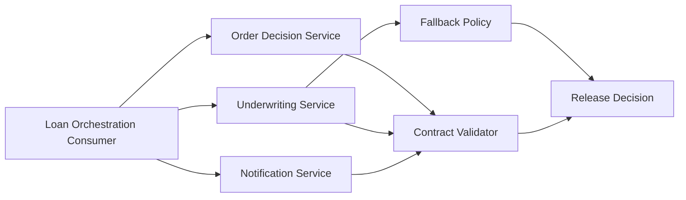

# Microservices Contract and Integration Testing

Contract testing for microservices, demonstrated end to end: a loan-orchestration consumer calls three local services (order, underwriting, notification), every response is validated against a consumer-owned contract, and schema drift or timeouts surface as explicit release decisions instead of silent failures.

Dependencies are virtualized with WireMock so the whole thing runs locally with no external services.

## Architecture



## Quick Start

```bash
python demo/contract_demo.py --scenario happy-path
```

PowerShell:

```powershell
.\run-demo.ps1 --scenario happy-path
```

## Key Scenarios

1. **Happy path** — all three services honor their contracts: `python demo/contract_demo.py --scenario happy-path`
2. **Schema drift** — the order service changes its payload and the run fails fast: `--scenario schema-drift`
3. **Timeout fallback** — underwriting times out, fallback policy kicks in, release decision degrades to warn: `--scenario timeout-fallback`

Run everything and generate the aggregated report:

```bash
python demo/run_release_suite.py
# writes reports/integration-suite-report.json
```

The report is machine-readable on purpose — it's designed to feed the release-governance evaluator in `cicd-quality-gates-reference-implementation`.

## What's Inside

- `contracts/` — consumer-owned JSON contracts for all three services
- `demo/` — runnable demo (`contract_demo.py`), contract validator, suite runner
- `integration-tests/` — Java integration tests (Maven): contract verification, dependency virtualization, provider API tests
- `virtual-services/` — WireMock stubs for the three dependencies
- `ci/` — GitLab CI and Jenkins pipeline templates
- `docs/` — architecture, risk map, and evidence from real runs

## Roadmap

- Pact-style consumer-driven contract test (pact generated by the consumer, verified by the provider)
- OpenAPI schema validation on provider responses
- CI gate that fails pull requests on contract drift
- Contract version diffing with breaking-change classification

## License

MIT — see [LICENSE](LICENSE).
