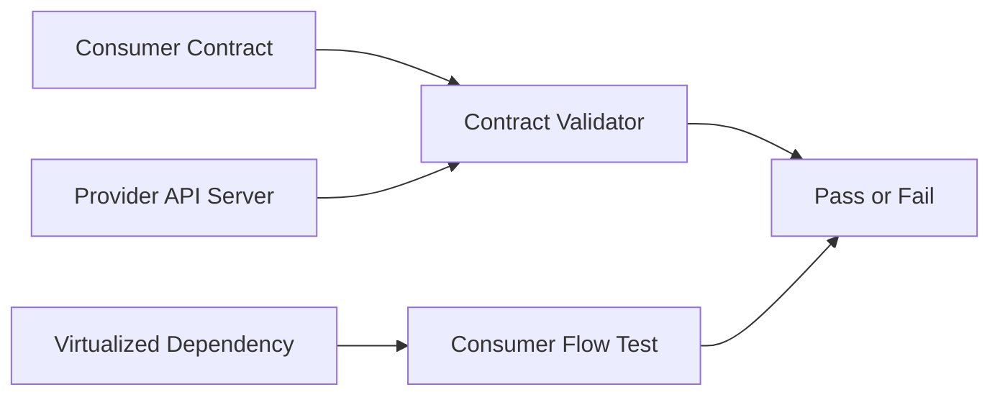

# Microservices Contract and Integration Testing

Reference repo for consumer-driven contracts, service virtualization, and integration validation across microservices.

## Business Value
- Proves the provider payload can be validated against a consumer-owned contract.
- Demonstrates dependency virtualization to keep tests stable and fast.
- Gives a practical pattern for reducing integration regressions in CI.

## Architecture


## What This Proves
- You can validate service boundaries, not just UI flows.
- You understand contract drift, resilience, and dependency isolation.
- You can operationalize microservices QA inside CI.

## Included in Day 1
- Runnable provider simulation using JDK HttpServer
- Rest Assured contract-style validation of real JSON responses
- WireMock-based dependency virtualization
- CI templates for GitLab and Jenkins
- JSON contract document and Python contract validator

## Quick Start
```bash
python demo/contract_demo.py
```

PowerShell alternative:
```powershell
.\run-demo.ps1
```

## Demonstrable Behavior
1. Starts a local provider server and validates order payload fields.
2. Spins up a virtualized dependency endpoint and proves the consumer can isolate it.
3. Validates provider response against a consumer-owned contract file.
4. Runs without external dependencies so it is immediately demonstrable.

## Core Files
- contracts/order_contract.json
- demo/contract_demo.py
- demo/contract_validator.py

## Evidence
See: docs/evidence.md

## Roadmap
1. Consumer contract tests
2. Provider verification pipeline
3. Integration workflows with retries and failure simulation
4. CI quality gate for contract drift
