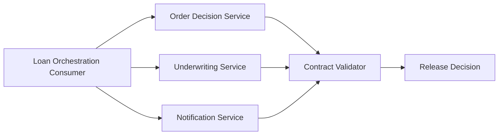

# Microservices Contract and Integration Testing

Reference repo for consumer-driven contracts, service virtualization, and integration validation across microservices.

## Business Value
- Proves a loan-orchestration consumer can block unsafe releases when upstream payloads drift.
- Demonstrates local service virtualization across multiple dependencies to keep integration checks stable and fast.
- Shows how consumer-owned contracts can reduce downstream defects in regulated workflows.

## Architecture


## What This Proves
- You can model multi-service integration risk, not just test a single endpoint.
- You understand contract drift, dependency isolation, and workflow-level correctness.
- You can make failure modes explicit enough to block a release decision.

## Included In This Version
- Multi-service orchestration demo for order, underwriting, and notification workflows
- Consumer-owned JSON contracts for all three services
- Contract validator that checks required fields, types, and allowed values
- Happy-path scenario and intentional schema-drift failure scenario
- CI templates for GitLab and Jenkins for future pipeline integration

## Quick Start
```bash
python demo/contract_demo.py --scenario happy-path
```

PowerShell alternative:
```powershell
.\run-demo.ps1 --scenario happy-path
```

## Demonstrable Behavior
1. Simulates a loan-orchestration consumer calling three local services.
2. Validates each service response against a consumer-owned contract.
3. Passes a realistic happy path when all contracts are honored.
4. Fails fast when the order service introduces schema drift.

## Key Scenarios
1. Happy path: `python demo/contract_demo.py --scenario happy-path`
2. Schema drift: `python demo/contract_demo.py --scenario schema-drift`

## Core Files
- contracts/order_contract.json
- contracts/underwriting_contract.json
- contracts/notification_contract.json
- demo/contract_demo.py
- demo/contract_validator.py
- docs/architecture.md
- docs/risk-map.md

## Evidence
1. Success run: docs/evidence.md
2. Failure run: docs/evidence-failure.md

## Roadmap
1. Add timeout and fallback scenarios for underwriting and notification dependencies.
2. Add CI gate that fails pull requests on contract drift.
3. Add contract version diffing and breaking-change classification.
4. Add release readiness output tied to integration scenario results.
